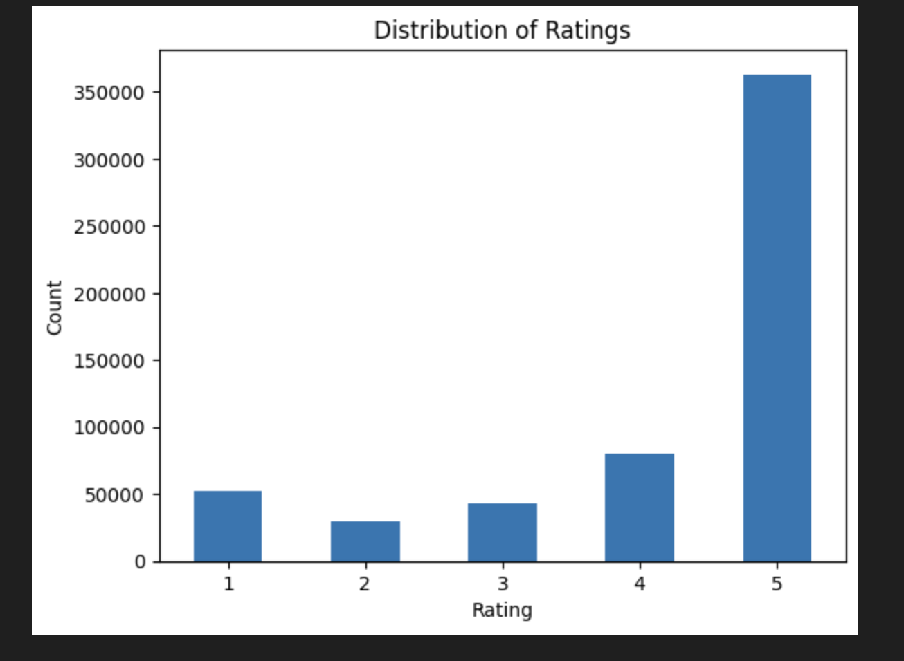
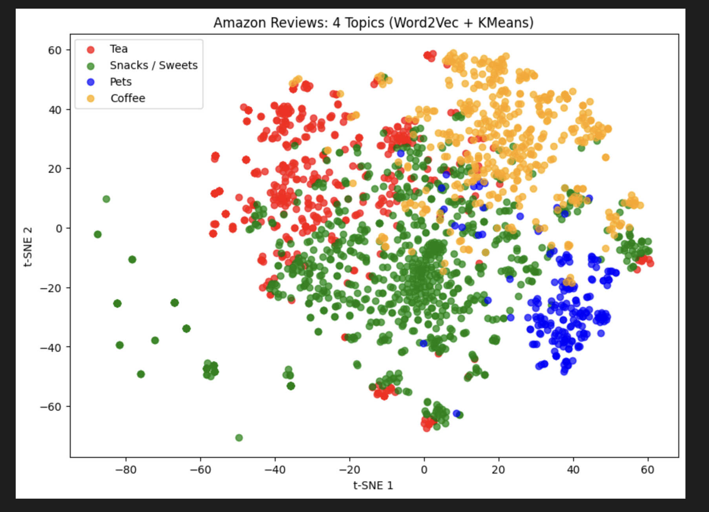
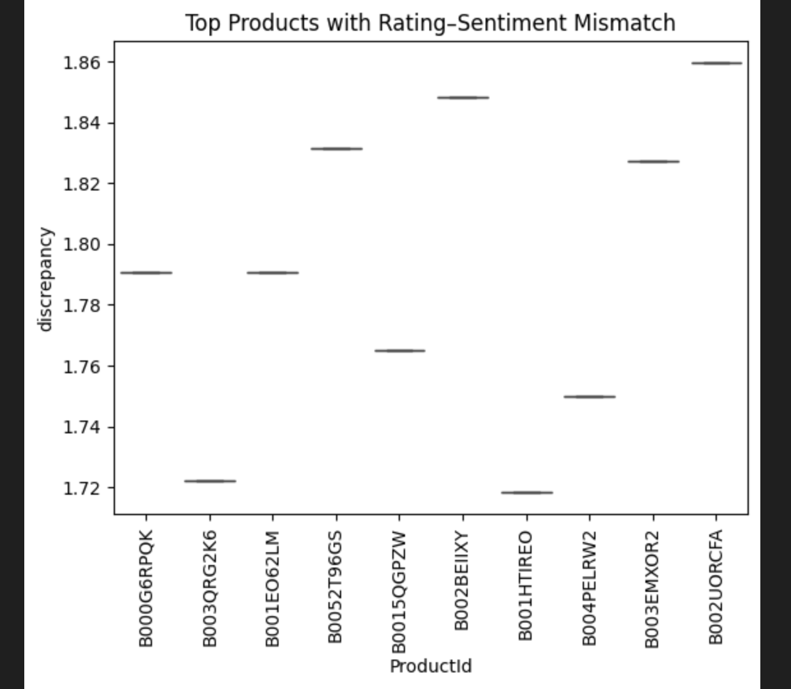

# Amazon Product Reviews Analysis

A machine learning and natural language processing project that analyzes over **500,000 Amazon product reviews** to predict sentiment, discover hidden review topics, and detect inconsistencies between ratings and written feedback.

A **data mining and natural language processing (NLP)** project that analyzes Amazon product reviews to:

- predict sentiment from review text
- discover underlying customer review topics
- identify mismatches between written sentiment and star ratings

---


---

## Project Overview

Customer reviews contain valuable insights about products.  
This project applies **machine learning and NLP techniques** to extract meaningful information from Amazon product reviews.

The analysis focuses on:

- **Sentiment prediction** from review text
- **Topic discovery** in customer feedback
- **Rating–sentiment discrepancy detection**

These insights help identify patterns in customer feedback and highlight products with inconsistent ratings.

---

## Research Questions

The project investigates three key questions:

### 1️⃣ Can sentiment be predicted from review text?

Using **TF-IDF features** and a **Logistic Regression classifier**, the model predicts review sentiment with an accuracy of **84.68%** on the test dataset.

### 2️⃣ What topics emerge in customer reviews?

Two topic discovery approaches are used:

- **Latent Dirichlet Allocation (LDA)**
- **Word2Vec embeddings + KMeans clustering**

These methods uncover common themes such as product categories and usage contexts.

### 3️⃣ Which products show mismatch between rating and sentiment?

Using **VADER sentiment analysis**, the project compares

```
written sentiment vs star rating
```

to identify products with **inconsistent feedback**.

---

## Dataset

Dataset: **Amazon Product Reviews dataset (Kaggle)**

https://www.kaggle.com/datasets/jillanisofttech/amazon-product-reviews

Main fields used:

- `ProductId`
- `Summary`
- `Score`

The dataset contains **500,000+ Amazon product reviews** including review text, product IDs, and rating scores.

---

## Tech Stack

- **Python**
- **pandas**
- **NumPy**
- **scikit-learn**
- **NLTK**
- **Gensim**
- **Matplotlib** 
- **Seaborn**

---

## Project Structure

```
amazon-product-reviews/
│
├── notebooks/
│   └── data-mining.ipynb
├── images/
├── data/
├── README.md
├── requirements.txt
└── .gitignore
```

---

## Methods Used

The following machine learning and NLP techniques were applied:

- **TF-IDF vectorization**
- **Logistic Regression sentiment classification**
- **Latent Dirichlet Allocation (LDA)**
- **Word2Vec embeddings**
- **KMeans clustering**
- **VADER sentiment analysis**
- **t-SNE visualization**
- **PCA visualization**

---

## Analysis Workflow

### Data Preprocessing

- removed missing summaries
- handled duplicate reviews
- cleaned text (HTML removal, punctuation removal)
- applied stopword filtering

### Sentiment Prediction

- converted ratings into **sentiment labels**
- extracted features using **TF-IDF**
- trained **Logistic Regression classifier**
- evaluated predictions using **classification metrics**

### Topic Discovery

Two complementary approaches were used to uncover themes in customer reviews.

**LDA Topic Modeling**

- extracted **4 major topics** based on word co-occurrence patterns
- identifies groups of words frequently appearing together in review summaries

**Word2Vec + KMeans Clustering**

- reviews converted into **100-dimensional word embeddings**
- reviews grouped into **4 semantic clusters**
- clusters visualized using **t-SNE and PCA**

### Rating–Sentiment Discrepancy

Using **VADER sentiment scores**, the project calculates:

```
discrepancy = |sentiment_score - rating_score|
```

This highlights products where **text sentiment does not match the star rating**.

The analysis identifies the **top products with the highest sentiment-rating mismatch**, revealing cases where customer written feedback contradicts the assigned star rating.


---

## Key Findings

- **Sentiment Prediction:** Logistic Regression trained on TF-IDF features achieved **84.68% accuracy** on the test dataset.

- **Topic Discovery:** LDA and Word2Vec + KMeans clustering revealed **4 interpretable customer review topics** representing common product categories and usage patterns.

- **Customer Feedback Patterns:** Topic clustering highlights meaningful groupings in customer reviews, demonstrating the usefulness of **unsupervised NLP techniques**.

- **Rating–Sentiment Discrepancy:** Several products show **significant mismatch between written sentiment and star ratings**, indicating potential inconsistencies in customer feedback.

- **Visualization Insights:** **t-SNE and PCA visualizations** reveal clear structure in review topic clusters.

---

## How to Run

Clone the repository:

```bash
git clone https://github.com/rutujad9/amazon-product-reviews-analysis.git
cd amazon-product-reviews-analysis
```

Create a virtual environment:

```bash
python -m venv venv
source venv/bin/activate
```

Install dependencies:

```bash
pip install -r requirements.txt
```

Download the dataset from Kaggle and place:

```
Reviews.csv
```

inside the **data/** folder.

Open the notebook:

```bash
jupyter notebook
```

Run:

```
notebooks/data-mining.ipynb
```

---

## Results Preview

### Rating Distribution


### Topic Clusters using t-SNE


### Rating–Sentiment Discrepancy


---

## Future Improvements

- apply **transformer-based sentiment models (BERT)**
- experiment with additional clustering algorithms
- analyze **full review text instead of summary only**
- build an **interactive dashboard** for product insights

---

## Author

**Rutuja D** 

MSc Informatik — Germany

---

## License

This project is provided for **educational and portfolio purposes**.

The dataset belongs to the original **Kaggle source**.

